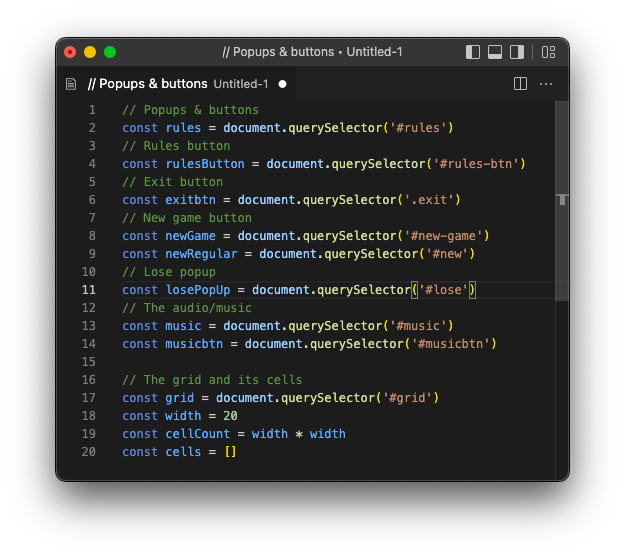
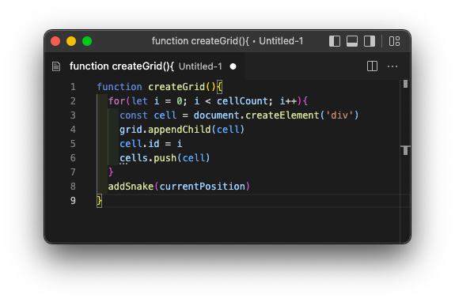

# Snake Game

### Play [HERE](https://eli099.github.io/Snake-Game/) 🕹

## Look and Feel (14/04/2022)


---

## The Project Brief

To create a game using grid movement through the use of the DOM.

* **The game should be rendered in the browser**, **built on a grid (that does not use HTML Canvas)**
* Use **Javascript** for **DOM manipulation**
* **Design logic for winning** -> **visually display if the player wins**
* **Include separate HTML / CSS / JavaScript files**
* Stick with **KISS (Keep It Simple Stupid)** and **DRY (Don't Repeat Yourself)** principles
* **Deploy the game publicly online**
* Use **semantic markup** for HTML and CSS

**I decided to choose the classic Snake Game.**

## Snake Game Brief

* The snake should be able to eat food to grow bigger
* The game should end when the snake hits the wall or itself
* Snake speeds up as it eats more

---

## The Game Rules & Controls

Snake is a single-player game where the player navigates around the board gaining points as it eats food that appears at random points on the grid. With each bite of food, the snake grows longer and increases in speed. The aim of the game is to gain as much points and survive long enough without hitting yourself or the edge of the grid - I chose to make it 'Game Over' if the player hits itself *only*.

### Controls

- Start the game with either the UP, **DOWN**, **LEFT**, **RIGHT** arrow keys
- Move your snake around the map with the **UP**, **DOWN**, **LEFT**, **RIGHT** arrow keys
- Eat eggs to grow and gain points
- Try to survive as long as possible by avoiding bumping into yourself

---

## Technologies Used:

### HTML
- The main body and content structure
- Sidebars
- Main title
- Sidebar and popup buttons
- Popups
- Linking google fonts
- Linking the CSS and Javascript files

### CSS
- Utilisation of flexbox to evenly structure the body elements
- `transition`s to smooth popup animations and the food appearing at random points on the grid
- Element background colours, borders and shadows
- `button:active` animations

### Javascript
- Tracking `keyDown` events to start the game and to move the snake around the grid
- `setInterval` to allow the snake to keep moving in one direction after **one** click
- `clearInterval` to end the interval within the callback function before each `'keyDown'` event
- Functions to add to and remove from the snake array (`currentPosition`)
- Conditional statement to control snake movement within the `setInterval`, within the function
- Functions to play and pause the music
- Functions to play sound effects - eating and game over
- A function for popup messages - the 'Rules' & Game Over
  * The messages popping up on button `click` or on game over
- Control flow to stop the snake from moving back on itself

---

## Fundamentals

### DOM Elements



I used `document.querySelector` to create variables from the HTML elements. This was so that I could later access or manipulate them with Javascript and the DOM. I started of initially with just the variables for the `grid`, the grid `width`, the `cellCount` and an empty `cells` array that represents the grid that I could later iterate through.

### The Grid



I defined this `createGrid()` function so that I could create my game grid. I first created a new `div` and saved it to a `cell` variable and then appended it to the `grid` div container. Then I pushed this cell into the `cells` array. These were all wrapped inside of a for loop that was defined to create 100 cells within the `grid` element.

## Challenges

At the beginning of the project I felt quite overwhelmed about how I could use what I learnt before to create the game. I found that taking it step by step helped. After planning with a wireframe, writing pseudo code, and revising previous lessons I felt a little better.

There were a couple of times where I had to ask for help from the instructional team:

I had managed to make the snake move continuously after pressing an arrow key once with `setInterval` but there was a problem. If another arrow key was pressed, the snake would start moving erratically in different directions. I realised that the previous increment (direction) wasn't being cleared so it was accumulating with every new `keyDown` event. So I played around with different ideas, researched and tried invoking `clearInterval` at different points in the code but it still wasn't working.

| Solution |
| ------ |
| After asking for help I learnt that if I made a global variable for the interval `snakeMove` then I could clear it with `clearInterval(snakeMove)` before each new `keyDown` event was used to change direction. |

Another thing I couldn't figure out was how to stop the snake from moving back on itself in the opposite direction.

My instructor helped me to see that if I stored the previous direction in a variable `oldDirection` then I could create another conditional statement (within the function) that would disallow the player from moving the snake in the direct opposite direction.

```jsx
// Outside keydown function
// Previous direction
let oldDirection

// Inside keydown function
const key = event.keyCode
const up = 38
const down = 40
const left = 37
const right = 39


if (oldDirection === up && key === down) {
  return
} else if (oldDirection === down && key === up) {
  return
} else if (oldDirection === left && key === right) {
  return
} else if (oldDirection === right && key === left) {
  return
} else if (key !== up && key !== down && key !== left && key !== right) {
  return
}
```

From there I was able to figure out how to add food to a random point on the grid, apart from the snake's body - again with some control flow. I made it so that if a cell already included the 'food' class (determined by the `randomIndex`) then it would loop back around and generate a new index, and repeat this until there is not a food there already.

```js
// Snake position that changes
let currentPosition = [startPosition, startPosition + width]

// * The Food - References the '.food' class in the CSS
const foodClass = 'food'

// Adding food class to random cells
function addFood() {

  let looping = true

  while (looping) {
    randomIndex = Math.floor(Math.random() * 100)
    if (currentPosition.includes(randomIndex)) { // Make it so that food isn't added in same place as snake body
      console.log('we don\'t want ->', currentPosition[randomIndex]) // Checking where it would've been
      // Do nothing
    } else {
      cells[randomIndex].classList.add(foodClass) // Add food to that random cell number
      looping = false // Stop the loop
    }
  }
}
```

## Bugs

- At the start of the game, if the DOWN key is pressed, the game ends.

### Improvements

There are some things I would like to do to improve the game and site.

- Add a favicon with a logo for the website

- Fix bug that ends the game before you start if the DOWN key is pressed

- Add an option to increase accessibilty for those with visual impairment or or sensitivities
    *  mute the colours (make black and white or use colours that are 'easier' on the eyes)

- Find a way to reset the game without the music stopping (if playing already).

- Allow different game modes, e.g 'Hard', 'Easy'
    * A 'Hard' mode where the snake dies if it touches the edge of the grid

## Asset Credits

### Images

* Food - Egg [Icons8](https://icons8.com/icon/set/food/fluency)

### Sound

- Background music: [CFCF - Slippery Plastic Euphoric](https://soundcloud.com/cfcf/slippery-plastic-euphoric-1)

- Eating sound: https://freesound.org/people/cabled_mess/sounds/350873/

- Lose sound: https://freesound.org/people/cabled_mess/sounds/350922/